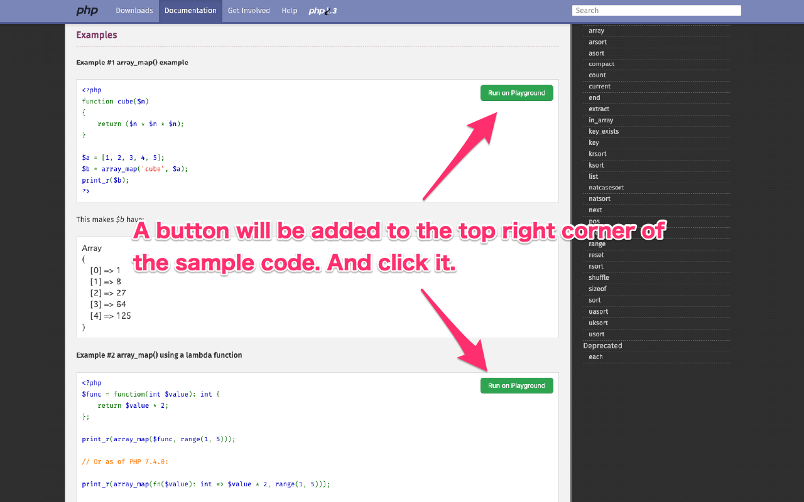
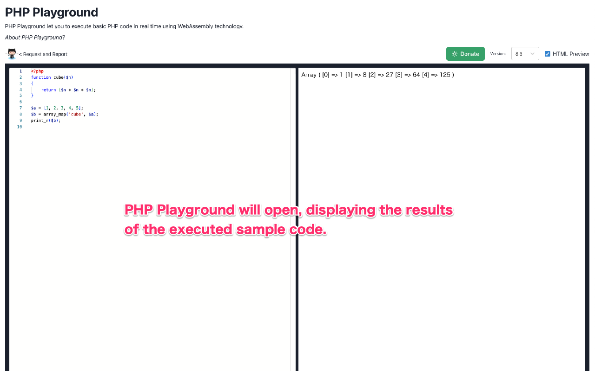

# Run on PHP Playground

Open PHP Playground and run the sample code from php.net.

**Install from Chrome Web Store**  

https://chromewebstore.google.com/detail/ddhmobhdfmhfckpkedkompdjdmpapeng

## How to use

1. Open https://www.php.net/*
2. Click "Run on PHP Playground" button
  
3. The code will be executed on PHP Playground
  

## What is "PHP Playground"?

The Playground let you to execute basic PHP code in real time using WebAssembly technology.

## Security

> PHP code is very secure because it is executed only within the browser using WebAssembly technology.
> In addition, the results of the execution are output to an iframe using an empty sandbox attribute, so no JavaScript or other code will run.

ref: https://php-play.dev/

## Request & Report

If you have any requests or find any bugs, please create an issue on GitHub.

https://github.com/meihei3/run-on-php-playground

## Links

- https://php-play.dev/
- https://github.com/glassmonkey/php-playground
